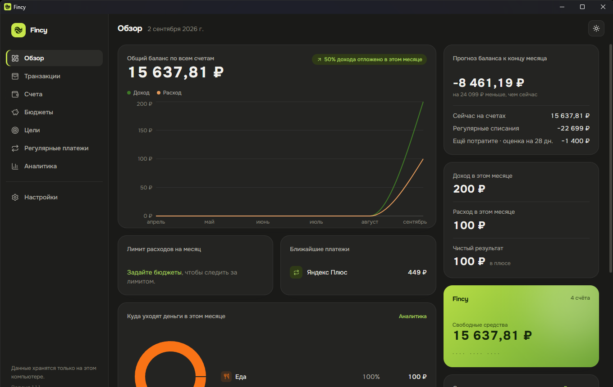

<div align="center">


# Fincy

**Настольный трекер личных финансов. Данные — только на вашем компьютере.**<br />
<sub>A local-first personal finance tracker. Your data never leaves your machine.</sub>

[](https://github.com/1rowvy/fincy/releases/latest)
[](LICENSE)
[](https://tauri.app/)

[Русский](#russian) · [English](#english)

</div>

<!-- Скриншот приложения / App screenshot:
     положите файл в docs/screenshot.png и раскомментируйте строку ниже
     drop a file at docs/screenshot.png and uncomment the line below
<div align="center"></div>
-->

---

<a name="russian"></a>

## 🇷🇺 Fincy — учёт личных финансов

Настольное приложение для учёта доходов и расходов: счета, бюджеты, регулярные
платежи, цели накоплений — в одном окне, с графиками и прогнозом баланса.

**Всё хранится только на вашем компьютере.** Ни аккаунтов, ни регистрации, ни
облака — приложение выходит в сеть лишь для проверки обновлений.

> Интерфейс приложения — на русском языке.

### Установка

1. Откройте [страницу релизов](https://github.com/1rowvy/fincy/releases/latest).
2. Скачайте установщик для Windows (`Fincy_x.y.z_x64-setup.exe` или `.msi`).
3. Запустите и пройдите мастер установки.

Новые версии приложение находит само при запуске и обновляется в один клик.
Проверить вручную — **Настройки → Проверить обновления**.

### Возможности

| | |
|---|---|
| **Счета** | Наличные, карты, текущие и накопительные. Баланс считается сам из операций, переводов и корректировок. |
| **Переводы** | Перемещение денег между счетами одной операцией. |
| **Корректировка баланса** | Для накопительных счетов — вписать текущую сумму, не заводя каждую операцию. |
| **Транзакции** | Категория, заметка, теги. Фильтры по счёту, категории, тегу, типу, датам и тексту. |
| **Бюджеты** | Месячный лимит на категорию, прогресс-бар, подсветка превышения. |
| **Регулярные платежи** | Подписки и счета создаются автоматически в день списания + напоминание заранее. |
| **Цели** | Накопительная цель на счёте: прогресс и, по желанию, срок. |
| **Аналитика** | Динамика доходов и расходов, чистый результат по месяцам, разбивка по категориям. |
| **Обзор** | Общий баланс, лимит на месяц, ближайшие платежи, цели, бюджеты под угрозой, **прогноз баланса на конец месяца**. |
| **Тема** | Светлая и тёмная с переключателем. |
| **Трей и автозапуск** | Старт вместе с системой, сворачивание в трей — чтобы напоминания работали всегда. |
| **Валюта** | ₽, $, € — выбирается в настройках. |

### Где лежат данные

В файле `fincy.db` в папке приложения (`%APPDATA%\com.rowvybeats.fincy\` в
Windows). Скопируйте этот файл для резервной копии или переноса на другой
компьютер.

---

<a name="english"></a>

## 🇬🇧 Fincy — personal finance tracker

A desktop app for tracking income and expenses: accounts, budgets, recurring
payments and savings goals in one window, with charts and a balance forecast.

**Everything is stored on your computer only.** No accounts, no sign-up, no
cloud — the app goes online solely to check for updates.

> The app's interface is in Russian.

### Install

1. Open the [releases page](https://github.com/1rowvy/fincy/releases/latest).
2. Download the Windows installer (`Fincy_x.y.z_x64-setup.exe` or `.msi`).
3. Run it and follow the wizard.

The app finds new versions on startup and updates in one click. To check
manually: **Settings → Проверить обновления**.

### Features

| | |
|---|---|
| **Accounts** | Cash, cards, checking, savings. Balance is derived from transactions, transfers and adjustments. |
| **Transfers** | Move money between accounts in a single operation. |
| **Balance adjustment** | For savings accounts — enter the current amount without logging every operation. |
| **Transactions** | Category, note, tags. Filter by account, category, tag, type, date range or text. |
| **Budgets** | Monthly per-category limit with a progress bar and over-limit warning. |
| **Recurring payments** | Subscriptions and bills post automatically on the due date, with an advance reminder. |
| **Goals** | A savings target on an account: progress and an optional deadline. |
| **Analytics** | Income/expense trend, net result per month, category breakdown. |
| **Overview** | Total balance, monthly limit, upcoming payments, goals, budgets at risk, **end-of-month balance forecast**. |
| **Theme** | Light and dark, with a toggle. |
| **Tray & autostart** | Launches with the OS and minimizes to the tray so reminders always run. |
| **Currency** | ₽, $, € — chosen in settings. |

### Where the data lives

In `fincy.db` inside the app's data directory
(`%APPDATA%\com.rowvybeats.fincy\` on Windows). Copy this file to back up or move
your data to another computer.

---

## 🛠 Сборка из исходников / Building from source

Требуется / Requires: [Node.js](https://nodejs.org/) 20+,
[Rust](https://www.rust-lang.org/) (stable),
[Tauri system dependencies](https://tauri.app/start/prerequisites/).

```bash
npm install
npm run tauri dev      # режим разработки / development mode
npm run tauri build    # установщик в / installer to  src-tauri/target/release/bundle/
```

Стек / Stack: **Tauri v2**, **React 19 + TypeScript**, **SQLite**
(`@tauri-apps/plugin-sql`), **TanStack Query**, **Recharts**, **Tailwind CSS v4**.

Выпуск релизов и автообновление описаны в [`docs/RELEASING.md`](docs/RELEASING.md).
Release process and auto-update are documented in
[`docs/RELEASING.md`](docs/RELEASING.md).

## Лицензия / License

[MIT](LICENSE)
